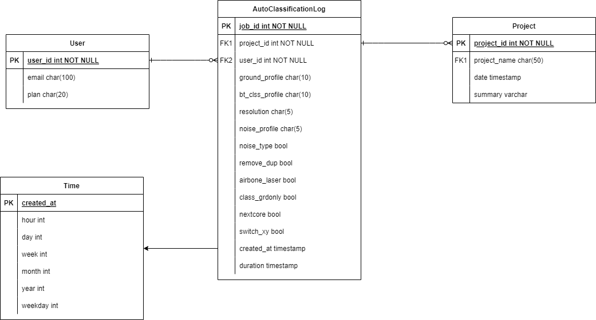
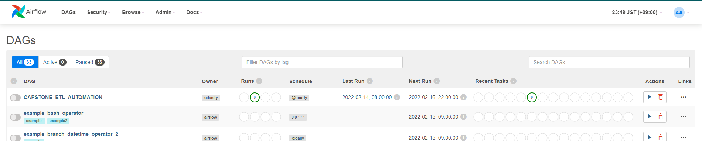

# Point Cloud Processor Log Analysis

## Story
A Startup company "Scx" which builts a software for point cloud processing through cloud-tech has grown rapidly these few years. Their core technology which is the point cloud auto-segmentation has been popular to the users as it will tremendously decrease their business workload. As to keep satisfying our user more with our core compitence we are eager to enhance the possibility of it. This startup fortunately saves their logs of any processing so, as a data engineer, I am considering to utilize this data to achieve the goal. By this, data analyst will be able to get insite from the dataset by analysing it of how user execute the processing of auto-segmentation. 

## Objective
As a data engineer, I first desinged database schema based on discussion with the business developer (suppose). I built ETL workflow by using various tools and it will fill tables in the Redshift datawarehouse with transformed data. This makse Business analyst be able to use the datawarehouse for analysing using SQL what kind of process did the users performed, for instance.

## Technoligies

### 1. Airflow
Airflow has very useful and strong features as below.

1. Web Interface - A UI control dashboard for users and maintainers.
2. Scheduler - Orchestrates the execution of jobs on a trigger or schedule.
3. Work Queue - Used by the scheduler to deliver tasks that need to be run to the workers.
4. Worker Processes - The tasks are defined in the Directed Acyclic Graph (DAG). When the worker completes a task, it will reference the queue to process more work until no further work remains.
5. Database - Stores the workflow's metadata but not the data produced from the workflow itself, e.g. credentials, connections, history, and configuration.

### 2. Fact/Dimensional Star Schema
 The tables are designed as star schema as below so that it is flexible to analyze.

* Fact table: AutoClassificationLog
* Dimension table: User, Project, Time

### 3. AWS Redshift
Amazon Redshift is a data warehouse product which forms part of the larger cloud-computing platform

### 4. AWS Storage
Amazon S3 or Amazon Simple Storage Service is a service offered by Amazon Web Services that provides object storage through a web service interface. 

## Dataset
Supposed that Scx regularly saves the logs for auto-classification process as CSV format. In this project, we retrieve the csv from the s3 path below and begin the ETL process. 
s3://scx-hiroshi/auto_classify_jobs_concatenated.csv

## Setup
1. Built container by docker image using `docker-compose.yaml`. Please follow this [official document](https://airflow.apache.org/docs/apache-airflow/stable/start/docker.html)
2. Start the container, for example, by using Docker Desktop.
3. The Airflow UI should be available at http://localhost:8080
4. Setup AWS credentials and Redshift connections infromation on the Airflow.
5. Turn on the DAG and scheduled ETL process for the datasets will start.

## Structure Of Scripts

Structure descriptions of the main files are written below:

- dags/create_tables.py: Craeate the tables in the database if the tables does not exist.

- dags/dag.py: Defines the DAG, tasks and link the tasks in required order.

- plugins/operators/staging.py: Defines class to copy CSV data from S3 to staging tables in the Redshift via COPY SQL commmand, dynamically.

- plugins/operators/load_dimension.py: Defines class to load a dimension table from staging tables via INSERT SQL command, dynamically.

- plugins/operators/load_fact.py: Defines class to load a fact table from staging tables via INSERT SQL command, dynamically.

- plugins/operators/data_quality.py: Defines class to run data quality checks on all tables based on the parameter passed from DAG script.

- plugins/helpers/sql_queries.py: Consolidates the SQL queries for easy use and clear coding.

## Example Usage

#### Analyst wants to know what the specific user used ground profile to perform the auto-classification by months on 2021.

`` WITH u AS (SELECT * FROM "dev"."public"."auto_classification_logs" WHERE user_id=211) \
SELECT t.year, t.month, u.ground_profile, COUNT (*)
FROM u\
LEFT OUTER JOIN "dev"."public"."time" AS t ON u.created_at = t.created_at 
GROUP BY t.year, t.month, u.ground_profile  HAVING t.year = 2021 ORDER BY t.month, u.ground_profile; ``
